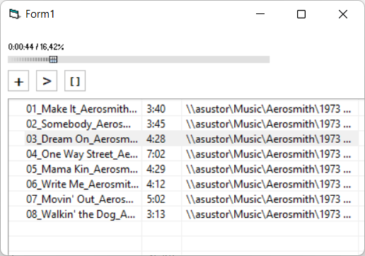

# WAB Player
WAB Player was a first attempt to create an audio player with
[BASS](http://www.un4seen.com) library.

## Acknowledgement
This project uses
* [BASS](http://www.un4seen.com) audio library (un4seen)
* cListView (Team HomeWork, 2004)
* [ucSlider](https://web.archive.org/web/20051106191612/http://www.planet-source-code.com:80/vb/scripts/ShowCode.asp?txtCodeId=28878&lngWId=1) ([Carles P.V.](https://github.com/Planet-Source-Code/PSCIndex/blob/master/ByAuthor/carles-p-v.md), 2005)
* epCmDlg (unknown)
* Fader (Alan Tucker, 2004)
* ucButton (unknown)
